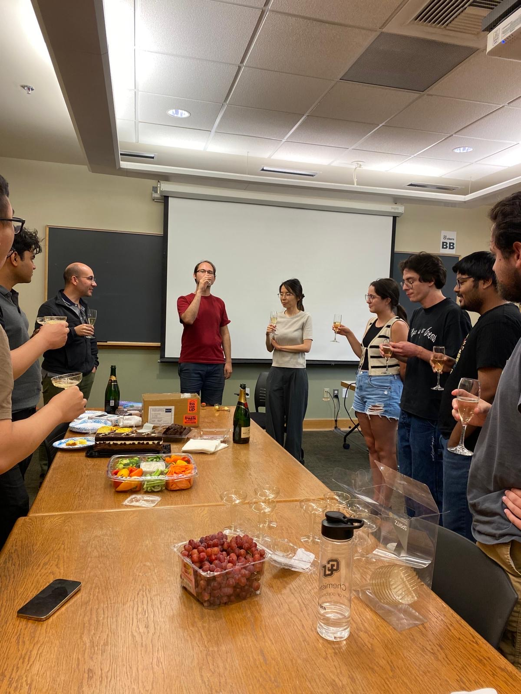
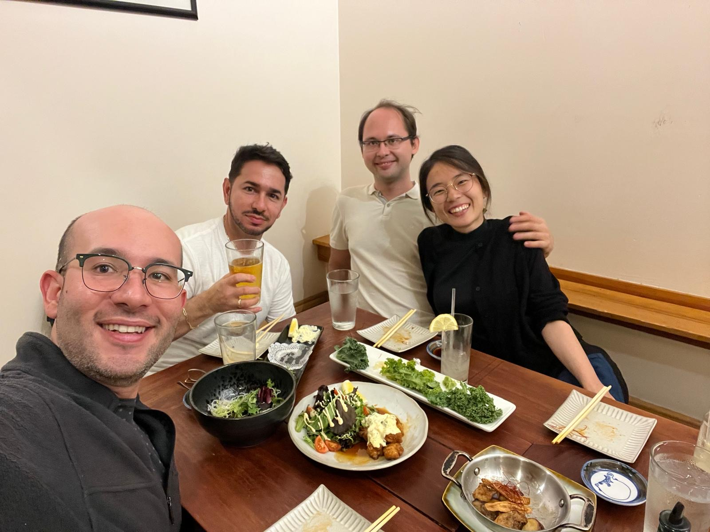

Congratulations to **Nanako Shitara** on an amazing PhD defense in
Physics! Nanako joins the Izmaylov and Brumer groups at the University of
Toronto as a postdoctoral scholar.

Nanako's thesis work in the group spanned quantum dynamics methods and
quantum noise spectroscopy, including the variational quantum noise
spectroscopy framework published in *J. Chem. Phys.*

  
  

